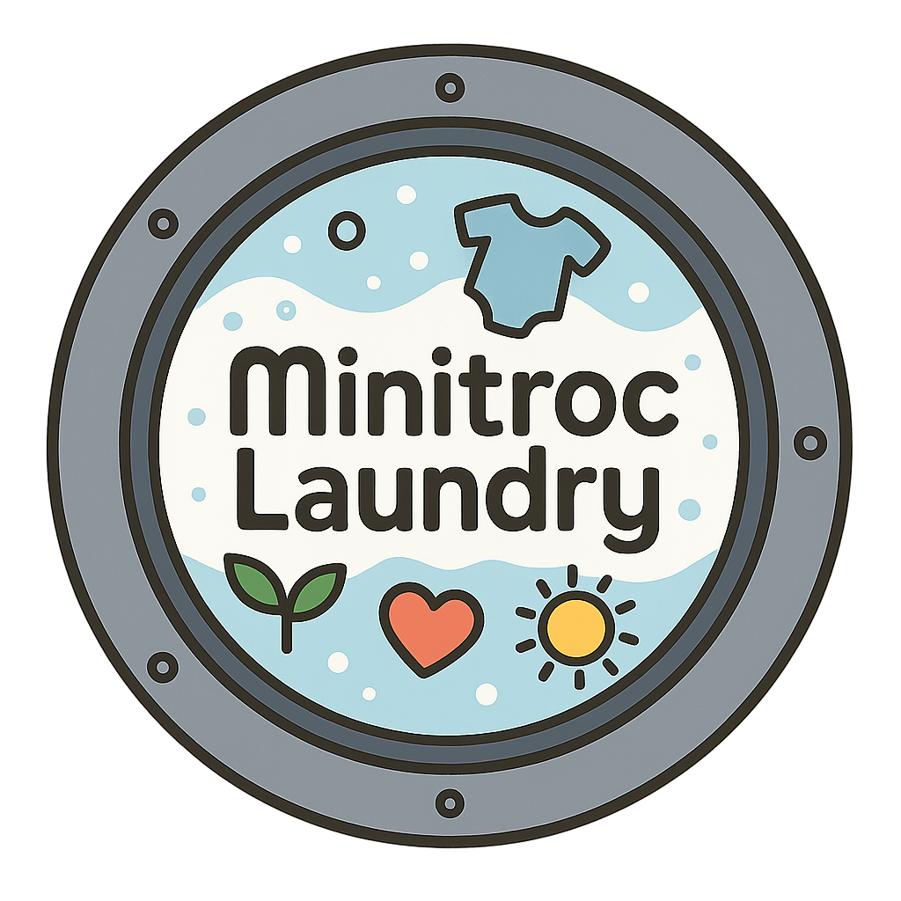

<div align="center">
  
  <h1>MiniTroc Laundry</h1>
  <p>Second-hand children's products management application</p>
</div>

## 📋 Overview

MiniTroc Laundry is a web application dedicated to managing second-hand clothing and products for children. This platform allows users to catalog, manage, and valuate their items considering brands, condition, and other characteristics.

## ✨ Features

- **Authentication**: Secure login system with Clerk
- **Product Management**: Add, edit, and delete items
- **Photo Capture**: Take photos directly from the application
- **Voice Recognition**: Voice commands to facilitate data entry
- **CSV Export**: Generate CSV files for data analysis
- **Automatic Pricing**: Calculate prices automatically based on brand and condition
- **Responsive Interface**: Adaptation to all devices

## 🚀 Getting Started

### Prerequisites

- Node.js 18+
- NPM
- PostgreSQL database
- Supabase account (for image storage)
- Clerk account (for authentication)

### Installation

1. Clone the repository:
   ```bash
   git clone https://github.com/your-username/minitroc-laundry.git
   cd minitroc-laundry
   ```

2. Install dependencies:
   ```bash
   npm install
   ```

3. Set up environment variables:
   ```bash
   cp .env.example .env.local
   # Edit .env.local with your own API keys
   ```

4. Generate Prisma types:
   ```bash
   npm run prisma:generate
   ```

5. Start the development server:
   ```bash
   npm run dev
   ```

6. Open [http://localhost:3000](http://localhost:3000) in your browser

## 🏗️ Technologies

- **Frontend**: React 19, NextJS 15, Tailwind CSS
- **Backend**: NextJS API Routes, Prisma
- **Database**: PostgreSQL
- **Authentication**: Clerk
- **Storage**: Supabase Storage
- **Forms**: React Hook Form, Zod
- **UI/UX**: TailwindCSS, Lucide React
- **Others**: React Speech Recognition, React Webcam

## 📁 Project Structure

```
/src
  /app            # Next.js routes and page components
    /actions      # Server Actions
    /dashboard    # Main interface after login
  /components     # Reusable React components
  /lib            # Utilities, hooks, and configurations
/prisma          # Database schema and migrations
/public          # Static files
```

## 🌟 Detailed Features

### Product Management

The application allows you to:
- Add products with photos
- Categorize by gender, size, season, etc.
- Set automatic prices based on brands
- Export data to CSV
- Bulk delete products

### Voice Recognition

Integration of voice commands for:
- Adding product names
- Entering descriptions
- Triggering photo capture

## 📊 Data Model

The system manages the following main entities:
- **User**: Application users
- **Product**: Items with their detailed characteristics

## 🔒 Security

- Secure authentication via Clerk
- Data isolation by user
- Protection of sensitive routes

## 🧪 Future Improvements

- [ ] Advanced search system
- [ ] Statistics and dashboards
- [ ] Native mobile application
- [ ] QR code system for products
- [ ] Integration with sales platforms

## 📄 License

This project is licensed under the MIT License. See the LICENSE file for more details.

## Getting Started

First, run the development server:

```bash
npm run dev
# or
yarn dev
# or
pnpm dev
# or
bun dev
```

Open [http://localhost:3000](http://localhost:3000) with your browser to see the result.

You can start editing the page by modifying `app/page.tsx`. The page auto-updates as you edit the file.

This project uses [`next/font`](https://nextjs.org/docs/app/building-your-application/optimizing/fonts) to automatically optimize and load [Geist](https://vercel.com/font), a new font family for Vercel.

## Learn More

To learn more about Next.js, take a look at the following resources:

- [Next.js Documentation](https://nextjs.org/docs) - learn about Next.js features and API.
- [Learn Next.js](https://nextjs.org/learn) - an interactive Next.js tutorial.

You can check out [the Next.js GitHub repository](https://github.com/vercel/next.js) - your feedback and contributions are welcome!

## Deploy on Vercel

The easiest way to deploy your Next.js app is to use the [Vercel Platform](https://vercel.com/new?utm_medium=default-template&filter=next.js&utm_source=create-next-app&utm_campaign=create-next-app-readme) from the creators of Next.js.

Check out our [Next.js deployment documentation](https://nextjs.org/docs/app/building-your-application/deploying) for more details.
